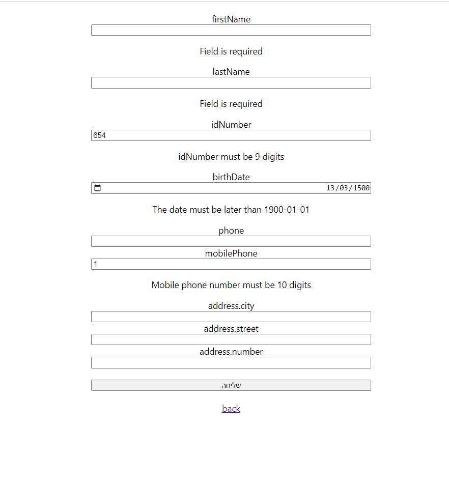

## Full Stack Project: Corona management system 

## miri mayevsky

This project uses MongoDB, Node.js, React to manage user information. It provides functionalities for:
- getting all users
- getting details user by id
- Adding new users
- Updating users details
- Deleting users
- Adding new vaccination  
- getting vaccination by id
- Updating vaccinations details
- Deleting vaccinations
- Adding new Corona disease  
- getting Corona disease by id
- Updating Corona disease details
- Deleting Corona disease

### Prerequisites

- MongoDB (version 7.0.7)
- Node.js (version 18.16.1) with npm
- React development environment (create-react-app recommended)

## Installation

**Backend:**
Make sure you have a compatible database system (MongoDB), Node.js Server and React installed and running.

Installations for backend:\
Terminal- 
   ``` cd NODE_PROJECT
   npm init -y
 npm install express mongoose cors dotenv joi nodemon
```

**Frontend:**
Create a separate React project directory:\
Terminal-
```npx create-react-app REACT_PROJECT
   cd REACT_PROJECT
   npm install axios react-router-dom 
   react-hook-form web-vitals
```

Database Setup:\
Update the database configuration in dbConfig.js to connect to your MongoDB database using the environment variables defined in the .env file.

**Running the Application**
Backend:\
Terminal-\
`nodemon main.js`

Frontend:\
Terminal-\
`npm start`

This will start the backend server and the React development server, allowing you to access the application in your browser (usually at http://localhost:3000).


| Method | URL Address | Discreption |
|---|---|---|
| GET | /api/users/getUser | get information for all users|
| GET | /api/users/getUserByParameter/:idNumber | get information for a specific user by their idNumber |
| POST | /api/users/PostUser | Adds a new user to the system |
| PUT | /api/users/updateUserByParameter/:idNumber | Update an exist user in the system |
| DELETE | /api/users/DeleteUserByParameter/:idNumber | Delete an exist user from the system |
| GET | /api/coronas/GetById/:idNumber | get information for a corona diseases of specific user by their idNumber |
| POST | /api/coronas/AddDisease |Add corona disease to a specific user by their idNumber |
| PUT | /api/coronas/UpdateDisease/:idNumber/:index | Update an exist corona disease in the system |
| DELETE | /api/coronas/deleteDisease/:idNumber/:index | Delete an exist corona disease from the system |
| GET | /api/vaccinations/GetById/:idNumber | get information for a vaccinations of specific user by their idNumber |
| POST | /api/vaccinations/PostVaccinations | Add vaccinations to a specific user by their idNumber  |
| PUT | /api/vaccinations/UpdateVaccinations/:idNumber :index | Update an exist vaccinations in the system |
| DELETE | /api/vaccinations/DeleteVaccination/:idNumber | Delete an exist vaccinations from the system |


#### You can use API calls in POSTMAN to make sure that all good.

### Attached Screenshot From Client: 





Thank you!
